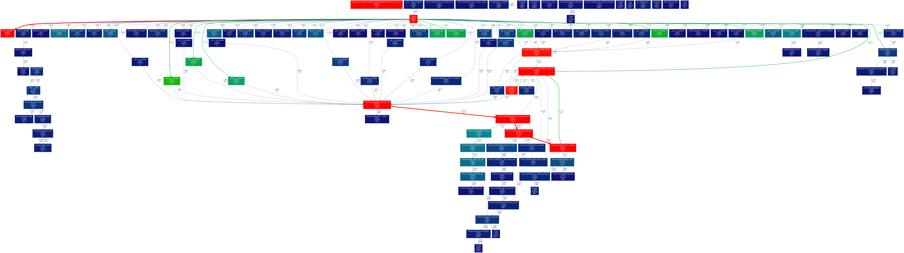

<!--header: "&nbsp;"-->


$$
\gdef\dst{\displaystyle}
\gdef\llangle{\left\langle}
\gdef\rrngle{\right\rangle}
$$


# &nbsp;&nbsp;&nbsp;&nbsp; Introduction to  <br> &nbsp;&nbsp;&nbsp;&nbsp; Programing Language 


## &nbsp;&nbsp;&nbsp;&nbsp;&nbsp; 2023.06.11


---


## Why do I use Julia

* Designed from the beginning for high performance
* Dynamical type system, but somehow "static"
* JIT (just-in-time) compilation
* Interactive use and compiled execution
* Native Julia Notebook: Pluto
* Functional programming

---

## When do I use Julia

* (when) C is too heavy but python is too slow

* Parallelization in Julia
  * Multithread
  * Distributed
  * *GPU*
  * *Instruction level (SSE,AVX)*


---
# Cases in research and teaching

---

## Case 1: Distributed parallelism (on a slurm cluster)

  see `parallel.jl`

<iframe src="http://localhost:8000/?tkn=b1f49aa7-722e-4697-bcd2-d8cb2794ea1d
" style="height:500px"></iframe>

---

* slurm script

  ```bash
  #!/bin/sh
  #SBATCH --output=pi.out
  #SBATCH --error=pi.err
  #SBATCH --partition=cpu
  #SBATCH --nodes=8
  #SBATCH --ntasks-per-node=96

  module load gsl/gsl-2.7.1
  module load julia/julia-1.8.5

  scontrol show hostname $SLURM_JOB_NODELIST > nodes_list.log 

  julia -O3 tHooft_bndry_sinn_pi_x_mpi_pion.jl > tHooft_pi.log 2>&1
  ```

---

```julia
@everywhere begin
  ...
  V_ϕ_tsk =[[i,j] for i in 1:Nϕ for j in i:Nϕ if iseven(i+j)]
  d_V_mtrx=zeros(Nϕ,Nϕ)

  @showprogress pmap(i->V_ϕ(V_ϕ_tsk[i][1],V_ϕ_tsk[i][2], d_V_mtrx), 1:size(V_ϕ_tsk)[1])

  Vmtrx=zeros(Nϕ,Nϕ)
  for i in workers()
      global Vmtrx += remotecall_fetch(()->d_V_mtrx,i)
  end
  ...
end
```
* Straightforward to translate from serial code
* `pmap` vs `@distributed`
  * `pmap` use process pool
  * `@distributed` distributes tasks evenly on workers


---

* `ClusterManager`
  communicating with slurm cluster

* `DistributedArrays`
  array distributed crossing nodes

* `pmap`: parallel mapping

* `remotecall_fetch`: fetches data from each nodes

* :cry: `scancel` is not guaranteed to terminate all remote julia process! 
  use `ssh node_i "killall julia"`

* :cry: Occasionally, `@every` takes extremely long time

---

## Case 2: Metaprograming

##### Workflow

* Analytical calculation in *Mathematica*
* *Mathematica* translate to c source files (CForm) &#129193; `lib.cpp`

  

* lib.cpp &#129193; lib.so

* load `lib.so` in julia: `ccall`
   > CAUTION: indices in C / julia starts from 0 / 1 

* Parallelization in julia


---

* Metaprograming is extremely useful

  * Vertex function of meson (particle) with different momenta

    see `lib.jl` and `lib.cpp`

    <iframe src="http://localhost:8000/?tkn=b1f49aa7-722e-4697-bcd2-d8cb2794ea1d" style="width:80%;height:400px"></iframe>

  * `0d0, 0d545, 17d44` &#129193; 0.0, 0.545, 17.44 .. are momenta of meson

* Pure C
  * A two dimensional array of function pointer ?


---

## Case 3: Data analysis with Pluto notebook

### Pluto notebook

> https://plutojl.org/

* Similar to jupyter notebook, but native in julia
* Start Pluto session

  ```bash
  julia> using Pluto

  julia> Pluto.run()
  [ Info: Loading...
  START /usr/bin/chromium-browser "http://localhost:1234/?secret=WloAZMUU"
  ┌ Info: 
  └ Opening http://localhost:1234/?secret=WloAZMUU in your default browser... ~ have fun!
  ┌ Info: 
  │ Press Ctrl+C in this terminal to stop Pluto
  └ 
  ```

---

* Example
  
  http://localhost:1234/?secret=7XxvpAtt


---

## Case 4: Renormalization in Lattice QCD calculation of transversity PDF and Scale evolution

* Renormalization
  * 4000 bootstrap resampled data for error estimation
    * 30 mpi processes, in 10min ! 
    > 500 bootstrap resample data: several days using *Mathematica*   

* Renormalization scale evolution usng RK-4
  * $\displaystyle \frac{\partial \textcolor{blue}{\boldsymbol{f(x,\mu)}}}{\partial\ln \mu} = \alpha_s(\mu)\int_x^1 \frac{dy}{y}P\left(\frac{x}{y}\right)\textcolor{blue}{\boldsymbol{f(y,\mu)}}$
  * `GSL`(GNU Scientific Library) warped in julia
  * `HDF5` in julia

---

* Renormalization scale evolution usng RK-4

  see `DGLAP_RK4.jl`

  <iframe src="http://localhost:8000/?tkn=b1f49aa7-722e-4697-bcd2-d8cb2794ea1d" style="width:80%;height:500px"></iframe>

---

## Teaching
* Comuptational Physics (graduate students), Sec. Monte-Carlo Method
  * Ex.1 RNG: LCG and Metroppolis-Hasting Algrithum
  * Ex.2 Path intgral quantization of 1-D Harmonic Oscillator
    $$
    \begin{aligned}
    U(x_f,t_f;x_i,t_i)=&\,\left(\frac{m}{2\pi i \hbar a}\right)^{\frac{N}{2}}\int \mathcal{D}x\, e^{\frac{i}{\hbar} S[x]}
    \end{aligned}
    $$

    see `RNG.jl` and `HO_MH.jl`

    <iframe src="http://localhost:8000/?tkn=b1f49aa7-722e-4697-bcd2-d8cb2794ea1d" style="width:80%;height:350px"></iframe>


---

## What I don't like
* tensnor operations are counterintuitive
  ```julia
  julia> M
  2×9 Matrix{Float64}:
   1.0  2.0  3.0   10.0   20.0   30.0  0.1   0.2   0.3
   4.0  5.0  6.0  400.0  500.0  600.0  0.04  0.05  0.06

  julia> sum(M,dims=(1))
  1×9 Matrix{Float64}:
   5.0  7.0  9.0  410.0  520.0  630.0  0.14  0.25  0.36
  ```


* no straightforward approach for converting `Vector{Vector{...}}` or `Vector{Array{...}}` to `Array{T,dims}`
  
  > $[T_1$,$T_2$,...,$T_q]$ ($T_i$: array of type `Array{T,3}`, size=$r×s×t$) 
    &#129193; tesnor (of type Array{T,4}), size=$q×r×s×t$

  * **Untill `stack(a,dims)` in release 1.9**
  
* transpose a tensor (while keeping datatype) is funny 
  `permutedims(stack(reduce(hcat,T)),[2,1,4,3])` vs `np.transpose(T,(1,0,3,2))`
  

---

* `PyCall`: python/C indexing start from 0 but julia starts from 1

* `Pluto` automatically evaluate cells when a dependency changes, redefinition of variables are forbidden, multiple lines in single cell is forbidden

* Profiling: `Profile` vs `gprof`+`gprof2dot`

  

  > `ProfileSVG` and `PProf.jl` are available in julia now

* Ecosystem


---

## To try

* Native `SSE`, `AVX` instruction support
  * `LoopVectorization` ...
* Native GPU supoort
* `Pluto` notebook in teaching
* ...
